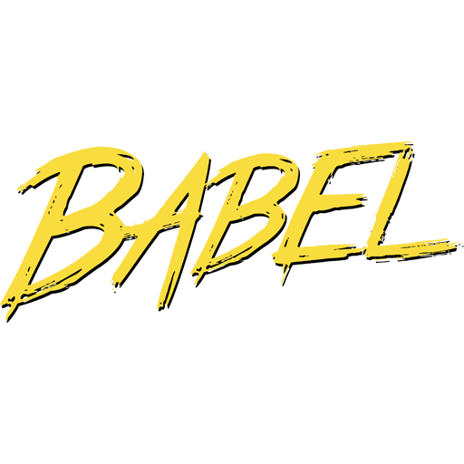

# React Boilerplate for Modern WebApp

|  |  |  |  |  |  |  |
| :--------------------------------------------------------: | :------------------------------------------------------: | -------------------------------------------------------------- | ------------------------------------------------------------------------ | ---------------------------------------------------------- | -------------------------------------------------------- | -------------------------------------------------------------- |

## Features

* React hot loading
* Sass support
* PostCSS support
* Jest ready
* Babel transpiling
* PWA enabled
* Eslint configured
* Stylelint configured
* Prettier configured
* GIT hooks configured

## Usage

1.  Clone or fork this repository
2.  Start coding

## TODO

* [ ] Add example code
* [ ] Add contribution guidelines
* [ ] Improve documentation

## Support

If you have any doubt open an issue I will take a look soon as I able.

## Licensing

This repository is released under the terms of [MIT license](LICENSE). If you use this repository you agree with its license.
